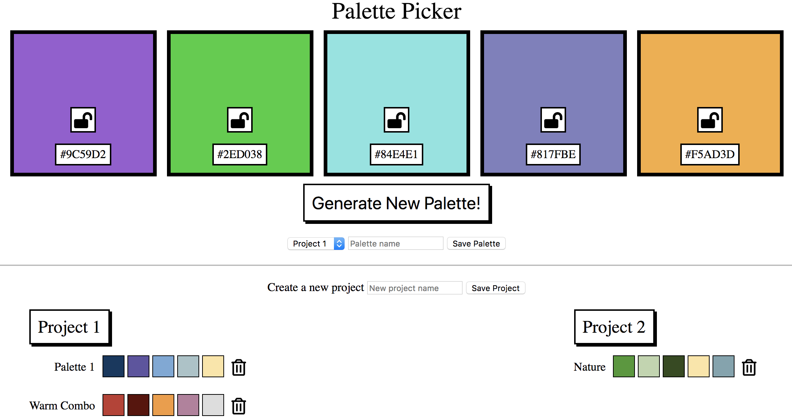

# Palette Picker - Alex Bonder - (FE Mod 4)

## Synopsis

Palette Picker is an application that allows a user to find random color palettes and save them in different folders.

The purpose of this project was designed to introduce us to backend languages in JavaScript.

[Project Spec](http://frontend.turing.io/projects/palette-picker.html)

[Live on Heroku](https://palette-picker-lexbonder.herokuapp.com/)

## Project Goals

* Create our own backend server using Node.js and Express
* Create our own database using Knex, PG, and PostgresQL
* Learn backend testing using Mocha, Chai, and Chai-Http
* Learn how to host a project on Heroku

## Installation

To set up: 

Fork or clone this project

Run `npm install` from the root directory

Run `node server.js` and visit localhost:3000 in your browser

You can begin running your tests with `npm test`

## Screenshots

